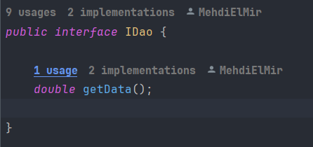
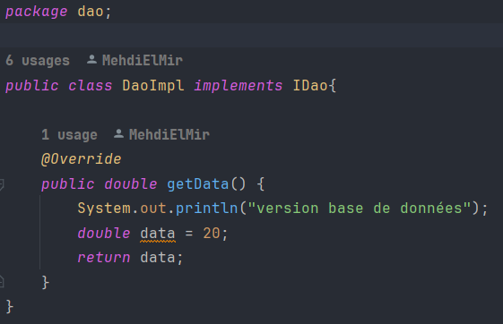
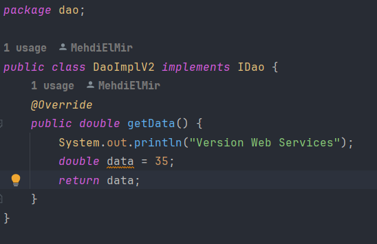
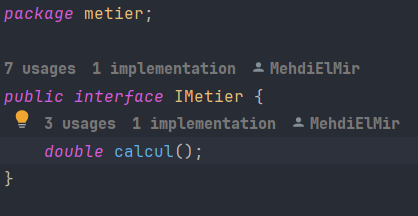
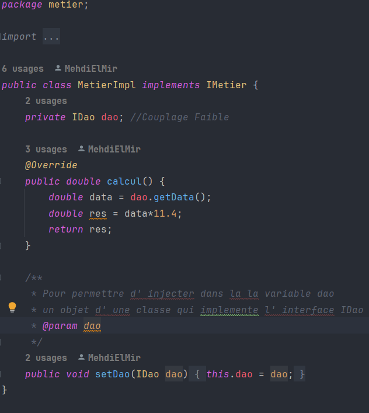
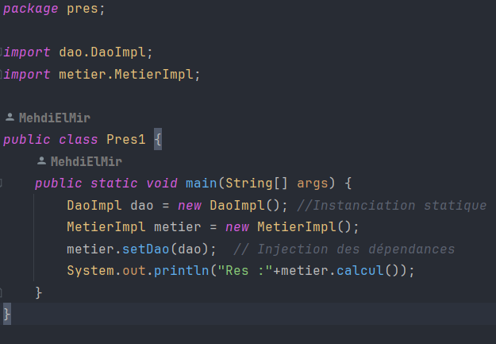
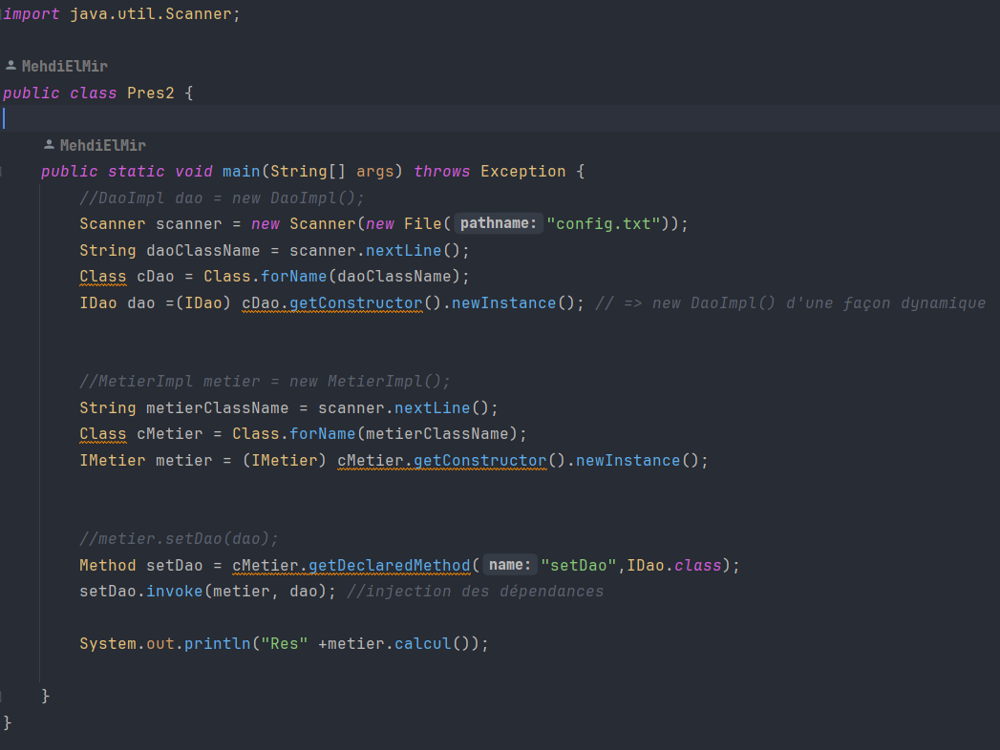
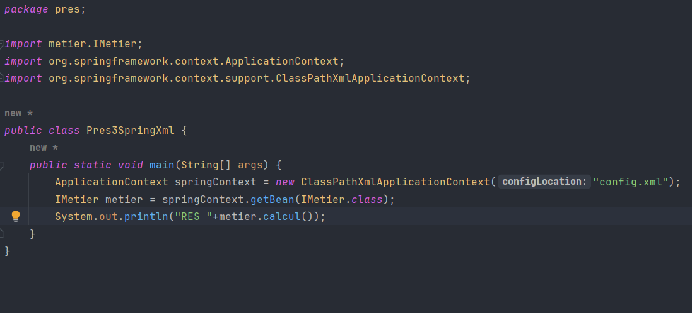

<h1 style="color: cornflowerblue">Rapport de l'inversion de contrôle et l'injection des dépendances</h1>
<h2 style="color: cadetblue">Introduction</h2>
<h2 style="color: cadetblue">Ennoncé</h2>
<ol>
    <li>Couche DAO 
        <ul>
            <li>créer l'interface IDao</li>
            <li>créer une implémentation de l'interface IDao</li>
        </ul>
    </li>
    <li>Couche Métier
        <ul>
            <li>créer l'interface IMetier</li>
            <li>créer une implémentation de l'interface IMetier</li>
        </ul>
    </li>
    <li>Couche Présentation
        
Créer une application qui permet de faire l'injection des dépandences

        <ul>
        <li>Instantiation statique</li>
        <li>Instantiation dynamique</li>
        <li>En utilisant Spring Framework
            <ul>
                <li>version XML</li>
                <li>version Annotation</li>
            </ul>
        </li>
        </ul>
    </li>
</ol>
<h2 style="color: cadetblue">Conception</h2>
<h3>Principe du couplage faible</h3>

Pour utiliser le couplage faible, nous devons utiliser les interfaces.
Considérons une classe DaoImpl qui implémente l' interface IDao, et une classe MetierImpl qui implémente l'interface IMetier.

Si la classe MetierImpl est liée à l’interface IDao par une association, on dit que le classe A et la classe B sont liées par un
couplage faible.

Cela signifie que la classe MetierImpl peut fonctionner avec n’importe quelle classe qui implémente l’interface IDao.
En effet la classe MetierImpl ne connait que l’interface IDao. De ce fait n’importe quelle classe implémentant cette
interface peut être associée à la classe B, sans qu’il soit nécéssaire de modifier quoi que se soit dans la
classe MetierImpl.

Avec le couplage faible, nous pourrons créer des application fermée à la modification et ouvertes à
l’extension.

<h2 style="color: cadetblue">Captures d'écrans</h2>
<h3>Création de l'interface IDao</h3>

<h3>Création d'une implémentation de l'interface IDao version Base de Données</h3>

<h3>Création d'une implémentation de l'interface IDao version web services</h3>

<h3>Création de l'interface IMetier</h3>

<h3>Création d'une implémentation de l'interface IMetier</h3>

<h3>Instantiation statique</h3>

<h3>Instantiation dynamique</h3>

<h3>Injection des dépendances en utilisant Spring version xml</h3>

On doit installer en premier lieu les dépandences, ensuite ajouter un fichier config.xml

